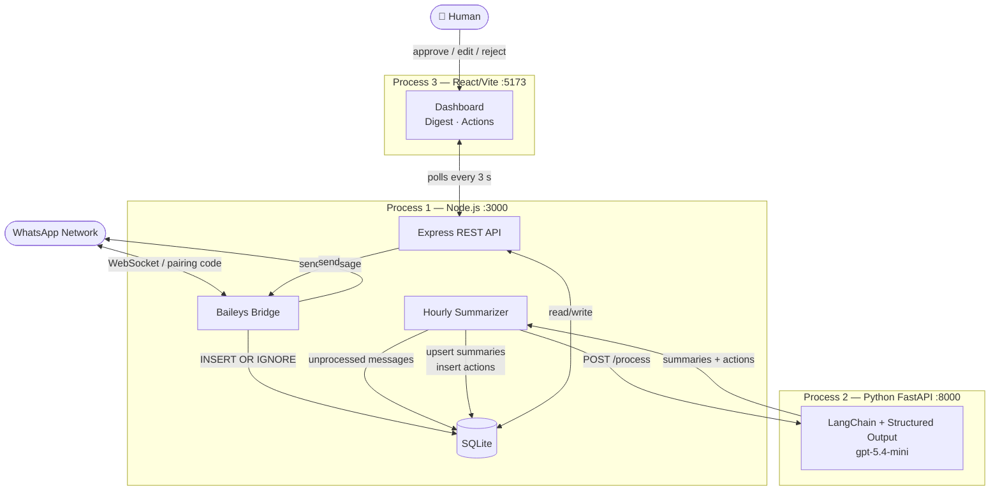

# Capstone Evaluation Criteria

---

## Problem Definition

### Scoping

An always-on agent that monitors WhatsApp **group** messages, produces daily summaries, detects social occasions (birthdays, anniversaries, congratulations, condolences), and drafts a group reply — held for human approval before sending.

**Explicitly out of scope:**
- 1:1 / DM messages — groups only
- Resource extraction and ToDo tracking
- General-purpose Q&A or command-driven bot behaviour

### Clarity

The agent's job is narrow: summarise what happened in a group today, and draft one greeting if a named occasion is evidenced in the messages. The output schema enforces this — `action_type` is a `Literal` of four values; nothing else can be returned. The system prompt states "when in doubt, emit no action" — silence is always a valid output.

---

## Data Processing

### Sources

Messages enter via two Baileys event paths:

- **`messages.upsert` (`type: notify`)** — live incoming messages, written to SQLite immediately
- **`messaging-history.set`** — WhatsApp pushes recent history on connect; processed batch-by-batch into the same table via `INSERT OR IGNORE`

Both paths share one handler; duplicates are silently dropped at the DB level.

### Handling PII

WhatsApp group messages contain names, phone numbers, and personal conversation content.

- **30-day purge** — `purgeOldData(30)` deletes processed messages and actions older than 30 days; runs at startup and every 24 hours (`index.js:25–26`)
- **Minimal LLM payload** — only `sender_name`, `body`, and `timestamp` are forwarded to the agent; `sender_jid` (phone number) and the full `raw_json` blob stored in SQLite never leave the machine
- **Per-group opt-in** — `summarize_enabled` defaults to `0`; no group is processed until explicitly enabled

### Guardrails

- **Human-in-the-loop is mandatory** — no auto-send path exists; every action requires `approve`, `edit`, or `reject` via the dashboard
- **Evidence rule** — `triggering_messages` in the prompt must contain verbatim quoted messages; the LLM cannot generate an action it cannot cite from the input
- **Dedup via `existing_actions`** — recent actions for a group are passed back each cron run with an explicit prompt instruction: "Do NOT generate any action for the same occasion or person — not even a reworded version"
- **Schema enforcement** — Pydantic `Literal` on `action_type` means the LLM cannot return freeform strings; a structurally invalid response raises a 500 before it reaches the DB

---

## System Design

### Architecture

Three processes, all local:

**Node.js** owns all I/O: Baileys WebSocket, SQLite, REST API, scheduling. **Python** is a stateless HTTP service — it receives a batch, calls the LLM, returns structured JSON, and has no DB access. **React** is a read-only dashboard plus the HITL approval flow.

### Tradeoffs

**ReAct agent → Structured Output (key architectural change)**

The initial implementation used a LangGraph ReAct agent with two tools (`save_summary`, `write_message`). A single run consumed **20,000+ input tokens** — the agent prompt, tool schemas, intermediate reasoning steps, and tool call/result pairs all compounded. Switching to a single LLM call with a Pydantic output schema cut input tokens by roughly **half** for the same payload, with no loss in output quality. The tradeoff: no multi-step reasoning, but the task doesn't require it — summarisation and occasion detection are single-pass problems.

**WhatsApp library selection**

| | Baileys | OpenWA | Botpress |
|---|---|---|---|
| Personal WhatsApp | Yes (pairing code) | Yes | No — requires Meta Business API + verification |
| Memory footprint | Lightweight | Heavy (full browser via Puppeteer) | N/A (hosted) |
| Speed | Fast | Slower (browser overhead) | N/A |
| Data ownership | Local | Local | Cloud — all messages stored on Botpress servers |
| Control | Full protocol access | Abstracted | Platform-constrained |
| Cost | Free | Free | Paid tiers; per-message WA API fees |

Botpress's HITL is a customer-support handoff model (bot → human agent), not a proactive draft-approval model. Building the same summarisation + occasion detection + draft approval flows inside Botpress would require the same engineering effort, constrained by their abstractions, with vendor and PII exposure added.

**Other tradeoffs**

| Decision | Choice | What was traded |
|---|---|---|
| Storage | SQLite (local file) | Not horizontally scalable; no ops overhead for a single-user system |
| Scheduling | `setInterval` hourly | Up to 1 h summary staleness; avoids per-message LLM calls and cost |
| Day-level batching | All messages per day in one LLM call | Slightly more tokens per call vs. smaller batches; far fewer total calls |

---

## Evals

### Task-specific

Two layers in `evals/`:

**Behaviour tests** (`test_tool_behavior.py`) — deterministic, binary pass/fail:

| Test class | What is asserted |
|---|---|
| `TestNormalChat` | 1 summary per partition, 0 actions, date and text non-empty |
| `TestBirthdaySingle` | Exactly 1 `birthday_greeting` action for 6 messages about Sarah |
| `TestBirthdayDedup` | 6 messages using 4 nicknames for the same person → 1 draft, not 6 |
| `TestBirthdayTwoPeople` | Two birthday people in one batch → 2 distinct drafts |
| `TestMediaOnly` | Summary written even with empty bodies; no action drafted |
| `TestMultiDay` | 2-partition request → 2 summaries with matching dates |
| `TestExistingActionsDedup` | Pre-existing action in `existing_actions` → no re-generation |

**Quality tests** (`test_quality.py`) — LLM-as-judge:
- `gpt-5.4-mini` scores summaries and birthday drafts on a 1–5 rubric (pass: ≥ 3)
- Rubric criteria: accuracy, conciseness, correct person named, tone appropriate for a group chat
- `test_summary_conciseness` is structural only (≤ 3 non-empty lines) — no LLM call needed

### Error Handling

- **Per-group isolation** — `summarizer.js` wraps each group in `try/catch`; one failing group logs an error without aborting other groups
- **LLM error wrapping** — FastAPI catches all `structured_llm.invoke()` exceptions and returns HTTP 500; the Node summarizer surfaces this as a per-group error
- **Reconnect guard** — `summarizerStarted` flag prevents duplicate `setInterval` registrations if Baileys reconnects mid-session
- **WA auto-reconnect** — `connection.close` handler calls `startWhatsApp()` recursively unless `DisconnectReason.loggedOut`
- **Message dedup** — `INSERT OR IGNORE` at DB level; duplicate Baileys events are silently dropped

### Cost

- **Single LLM call per group per hour** — day-level batching replaces per-message calls; the `processed` flag ensures messages are never re-sent
- **ReAct → Structured Output** — eliminated multi-turn reasoning overhead; ~50% token reduction on identical payloads (measured: 20k+ tokens with ReAct on a sample batch)
- **Minimal payload** — `sender_name`, `body`, `timestamp` only; no raw JSON or metadata
- **`existing_actions` context** — prevents re-generating (and billing for) duplicate drafts across runs
- **Opt-in groups only** — groups with `summarize_enabled = 0` are never processed

### Latency

- **Ingestion is instant** — Baileys events hit a synchronous SQLite insert; no LLM call blocks the WebSocket handler
- **LLM work is async** — the hourly summarizer decouples message arrival from LLM processing; the UI reflects summaries up to 1 hour after the last message
- **One localhost HTTP hop** — Node → Python agent round-trip is negligible relative to LLM response time
